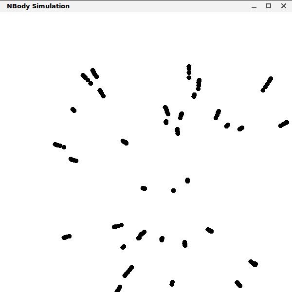

# SARL Demo: Body

This demo displays a universe with bodies that puts forces on each other thus changing their position with every tick.

This demo was provided by Sebastian Rodriguez.

## Description

The system is composed of a **Universe** agent and many **Body** agents that pose forces to each other.

The cycle of operation is as follows:

- First agent **Universe** creates the world an spawns a number of bodies.
	- Each body has a location, mass, velocity, and a given current _force_ on it.
- Then **Universe** emits a *Tick* event every `TICK_DELAY`. At every tick, each body:
	- updates its position (based on current location, velocity, and force).
	- informs its body to everyone by emitting an `BodyInfo` event (location and mass).
	- resets its force to zero.
- Every time a body receives a `BodyInfo` event, a (different) body updates its force to account for that body.
- Every time **Universe** receives a `BodyInfo` event (from some body), it re-draws that body.

## Screenshot

